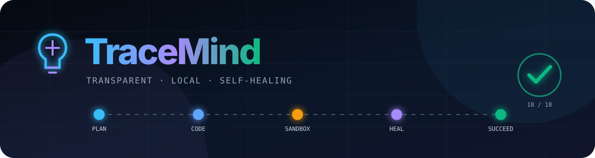
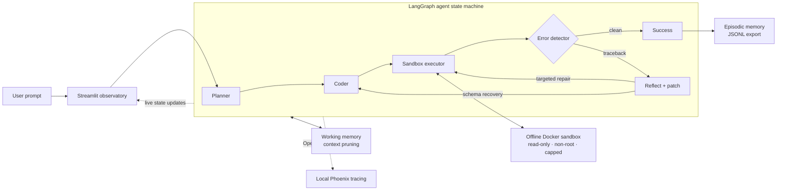

<div align="center">
  

  <p><strong>A local-first Python agent that plans visibly, executes in Docker, reads its own tracebacks, and repairs failed code.</strong></p>

  <p>
    <a href="https://www.python.org/"></a>
    <a href="https://www.docker.com/"></a>
    <a href="https://github.com/langchain-ai/langgraph"></a>
    <a href="https://ollama.com/"></a>
    <a href="https://streamlit.io/"></a>
    <a href="LICENSE"></a>
  </p>
</div>

---

TraceMind turns agent failures into inspectable state transitions. The planner,
coder, sandbox, error detector, and reflector are explicit LangGraph nodes.
Every generated program runs inside an offline, read-only Docker container.
When execution fails, TraceMind parses the real traceback, applies a minimal
validated patch, prunes stale context, and tries again—with a visible retry
limit.

## Measured benchmark

The committed 18-task fixture benchmark covers missing columns, schema drift,
zero division, index bounds, missing dependencies, malformed syntax, null
handling, parsing errors, type mismatches, and clean baselines.

| Mode | Success | Success rate | Avg. repairs | Avg. raw tokens¹ | Avg. retained tokens¹ | Reduction |
|---|---:|---:|---:|---:|---:|---:|
| Single-pass execution | 6/18 | **33.33%** | 0.00 | 196.32 | 196.32 | 0.00% |
| TraceMind self-healing | 18/18 | **100.00%** | 0.67 | 962.33 | 830.47 | **13.70%** |

> **+66.67 percentage points in measured task completion.** Both modes used the
> same local Docker sandbox. These results describe the committed deterministic
> fixture benchmark; they are not a universal claim about every model or coding
> task.

¹ Token counts are transparent estimates at four characters per token.
[Read the task-level report](docs/benchmark_report.md) or inspect the
[machine-readable results](docs/benchmark_report.json).

## Architecture



## Why TraceMind

- **Transparent by construction** — plans, tool inputs, node transitions,
  sandbox output, tracebacks, patches, retries, and context pressure are
  inspectable. The dashboard presents observable rationale, not private hidden
  chain-of-thought.
- **Self-healing execution** — structured traceback parsing identifies the
  terminal exception and stack frames; exact-text edits are syntax-validated
  before re-execution.
- **Hardened Docker isolation** — generated code has no network, runs as an
  unprivileged user, uses a read-only root filesystem, and receives CPU,
  memory, PID, and wall-clock limits.
- **Local models, no per-token API bill** — Qwen 2.5 planning and coding models
  run through Ollama on your machine. Hardware and electricity costs still
  apply.
- **Bounded memory** — system policy, user intent, the newest traceback, and the
  latest patch survive while stale attempts and verbose logs are compacted.
- **Live observability** — Streamlit animates node activity, state topology,
  estimated token pressure, retries, artifacts, and terminal output. Phoenix
  adds local OpenInference traces.
- **Rigid tool contracts** — Pydantic schemas reject malformed model output and
  unsafe execution parameters before they cross the tool boundary.

## Quickstart

Prerequisites: Python 3.11+, Docker Desktop, and
[Ollama](https://ollama.com/).

### 1. Install and start the isolated services

```bash
git clone https://github.com/yeshengliu/TraceMind.git
cd TraceMind
python -m venv .venv
source .venv/bin/activate
pip install -r requirements.txt
docker compose pull sandbox
docker compose --profile observability up -d phoenix
```

### 2. Pull the local models

```bash
ollama pull qwen2.5:7b
ollama pull qwen2.5-coder:7b
```

### 3. Launch the observatory

```bash
streamlit run app.py
```

Open:

- TraceMind dashboard: `http://localhost:8501`
- Phoenix traces: `http://localhost:6006`

Phoenix is optional. The dashboard continues to work if the collector is
offline.

## The healing loop

1. **Plan** — `qwen2.5:7b` returns a schema-constrained execution plan.
2. **Code** — `qwen2.5-coder:7b` returns complete Python plus a bounded timeout.
3. **Execute** — the Phase 1 tool runs the program in the locked-down container.
4. **Detect** — non-zero exits and Python tracebacks become structured state.
5. **Reflect** — the coder model diagnoses the root cause and proposes minimal
   exact-text edits.
6. **Validate** — TraceMind verifies edit targets and runs `ast.parse` before
   accepting the patch.
7. **Retry** — the graph re-enters the sandbox, capped at three corrections.
8. **Remember** — successful trajectories enter episodic memory; noisy working
   context is pruned.

## Benchmark pipeline

Run the reproducible exact-oracle benchmark:

```bash
python -m src.eval.benchmark
```

This performs 36 top-level evaluations—18 single-pass and 18 full-engine
runs—plus patched retries for failed full-engine attempts. It rewrites:

- `docs/benchmark_report.json`
- `docs/benchmark_report.md`

Use live local model reflection and the structured LLM judge:

```bash
python -m src.eval.benchmark --reflector ollama --judge ollama
```

The dataset is plain JSONL, so new cases can be reviewed and added without
changing evaluator code:

```json
{
  "id": "missing-dict-column",
  "category": "missing column",
  "prompt": "Sum the amount field.",
  "program": "total = sum(row[\"missing_amount\"] for row in records)",
  "expected_stdout_regex": "^TOTAL=34$",
  "repair": {
    "root_cause": "The records contain amount, not missing_amount.",
    "edits": [{
      "old_text": "row[\"missing_amount\"]",
      "new_text": "row[\"amount\"]",
      "occurrence": 1,
      "reason": "Use the available column."
    }],
    "validation_notes": "The aggregation and output format are preserved."
  }
}
```

Every repair contains at least one reviewable, exact-text edit.

## Dashboard artifact protocol

Sandbox programs can publish rich output by printing marked lines:

```text
TREND_SVG=<svg ...>...</svg>
ARTIFACT_PNG_BASE64=<base64 PNG>
ARTIFACT_MARKDOWN=## Report
ARTIFACT_JSON={"value": 42}
```

SVG and PNG images, Markdown reports, JSON data, and raw terminal logs appear in
the right-hand dashboard pane.

## Project map

```text
TraceMind/
├── app.py                         # Streamlit entry point
├── data/benchmark.jsonl           # 18 reproducible edge cases
├── docs/
│   ├── assets/tracemind-hero.svg  # Animated GitHub hero
│   ├── benchmark_report.json      # Machine-readable measurements
│   └── benchmark_report.md        # Human-readable results
├── src/
│   ├── agent/
│   │   ├── graph.py               # LangGraph state machine
│   │   ├── llm.py                 # Ollama model router
│   │   ├── reflection.py          # Traceback parser + patch gate
│   │   └── tools.py               # Pydantic tool contracts
│   ├── eval/benchmark.py          # Dual-mode benchmark runner
│   ├── memory/pruner.py           # Working + episodic memory
│   ├── sandbox/test_sandbox.py    # Docker isolation boundary
│   └── ui/
│       ├── dashboard.py           # Animated dashboard
│       └── tracing.py             # Phoenix/OpenInference setup
└── tests/                         # Unit, integration, Docker, and UI tests
```

## Configuration

| Variable | Default | Purpose |
|---|---|---|
| `TRACEMIND_OLLAMA_BASE_URL` | `http://localhost:11434/v1` | Ollama-compatible API |
| `TRACEMIND_PLANNER_MODEL` | `qwen2.5:7b` | Planning and optional judging |
| `TRACEMIND_CODER_MODEL` | `qwen2.5-coder:7b` | Code generation and reflection |
| `TRACEMIND_LLM_TIMEOUT_SECONDS` | `120` | Local model request timeout |
| `TRACEMIND_PHOENIX_URL` | `http://localhost:6006` | Phoenix UI/collector |
| `TRACEMIND_PHOENIX_PROJECT` | `TraceMind` | Trace project name |
| `TRACEMIND_TRACING_ENABLED` | `1` | Set to `0` to disable telemetry |

## Verification

```bash
pytest -q
TRACEMIND_RUN_OLLAMA_TESTS=1 pytest -m ollama -q
```

The normal suite uses deterministic structured-model doubles and the real
Docker sandbox. Live Ollama tests are opt-in so CI remains reproducible.

## Security boundary

TraceMind is a research and local-development project, not a guarantee that
arbitrary generated code is harmless. Keep Docker Desktop updated, review
resource limits before deployment, do not mount sensitive host directories into
the sandbox, and do not expose Ollama, Phoenix, or Streamlit directly to an
untrusted network.

## License

[MIT](LICENSE)
